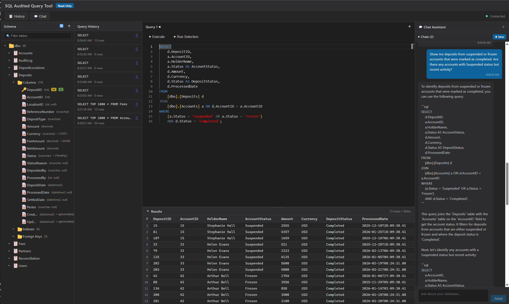

# SQL Audited Query Tool

A readonly SQL database query application designed for incident investigation, with a full GitHub issue audit trail.

## Features

- **Readonly SQL Queries** — Execute SELECT queries against SQL Server databases with enforced read-only access
- **GitHub Issue Audit Trail** — Every query execution is logged as a GitHub issue for compliance and traceability
- **Local LLM Query Assistance** — AI-powered query suggestions via a local LLM using tool calling (Ollama requests query execution from our .NET app; Data is only exposed to the local LLM running in the container host)
- **Chat Interface** — Conversational UI for building and executing queries
- **EF Core Code Discovery** — Optional discovery of existing EF Core models and mappings to aid query construction



## Architecture

```
src/
  SqlAuditedQueryTool.Core        — Domain models, interfaces, shared types
  SqlAuditedQueryTool.Database    — SQL Server readonly connection, query execution, EF Core contexts
  SqlAuditedQueryTool.Audit       — GitHub issue audit logging
  SqlAuditedQueryTool.Llm         — Local LLM integration, tool calling handler, query generation
  SqlAuditedQueryTool.App         — Main application with chat UI

tests/
  SqlAuditedQueryTool.Core.Tests
  SqlAuditedQueryTool.Database.Tests
  SqlAuditedQueryTool.Audit.Tests
  SqlAuditedQueryTool.Llm.Tests
```

## Prerequisites

- .NET 10.0 SDK or later
- Docker Desktop with WSL2 backend
- SQL Server instance (read-only access)
- GitHub token (for audit logging)
- NVIDIA GPU (recommended for local LLM — see GPU Setup below)

## Getting Started

```bash
dotnet build
dotnet test
dotnet run --project src/SqlAuditedQueryTool.App
```

## Testing with Sample Data

The application includes a realistic cash deposit platform dataset with intentional data anomalies designed for incident investigation scenarios. These errors can be discovered by querying the database and using the chat to analyze suspicious patterns.

### Known Data Errors & Anomalies

**Partner Issues**
- **Partner PSB** (ID 4): Negative fee percentage (-0.2%) instead of positive, indicating misconfigured fee structure
- **Partner ACB** (ID 6): Status is Suspended but still has an active API key, suggesting revocation was incomplete
- **Partner SWB** (ID 8): Status is Onboarding but deposits are already flowing through accounts, violating onboarding workflow

**User & Account Issues**
- **User tmiller** (ID 8): Marked Inactive but has a login within the last 3 days, indicating orphaned/stale status
- **Account 15** (Stephanie Hall): Status is Suspended but KYC remains Verified, inconsistent compliance state
- **Account 22** (Thomas Baker): Currency is GBP but all deposits received are in USD, data integrity error
- **Account 33** (Helen Evans): Status is Suspended yet has recent Completed deposits and high balance, suggesting stale status flag
- **Accounts 38-39** (ACB): Belong to the Suspended partner but accounts remain Active
- **Account 42** (Arthur Bell): Status is Frozen with negative balance (-$1,250), indicating incomplete processing or data corruption
- **Account 47** (Irene Richardson): KYC status is RequiresUpdate but account created 300+ days ago, stale compliance flag
- **Accounts 48-50**: KYC status is Pending yet they already have completed deposits, violation of KYC-before-processing rule

**Location Issues**
- **Location 9** (Hollywood Walk ATM): Status is Maintenance but deposits continue to be processed, operational state inconsistency
- **Location 20** (Seattle Downtown Branch): MaxDepositAmount is 0.00, effectively blocking deposits

**Fee Configuration**
- **Fee 9** (Partner PSB, BulkCash): MinFee ($150) > MaxFee ($15), inverted range logic error

**Deposit Transaction Anomalies**
- **Deposits 150-153**: Structuring/smurfing pattern — 4 deposits of ~$9,500-$9,800 each from Account 25 at the same location on the same day, just under the $10,000 reporting threshold
- **Deposits 160-164**: Velocity abuse — 5 identical deposits of $4,900 from Account 30 spread across 5 different cities within the same day
- **Deposits 180-182**: Ghost deposits marked Completed but ProcessedBy is NULL, suggesting automation bypass
- **Deposit 190**: Time-travel anomaly — SettledDate (26 days ago) is BEFORE ProcessedDate (24 days ago)
- **Deposits 195-198**: Zero-fee cash deposits with $0.00 FeeAmount (should never occur per fee schedule)
- **Deposits 200-203**: Deposits processed to Frozen (Account 42) and Suspended (Account 33) accounts marked Completed
- **Deposits 210-212**: Deposits completed against the Suspended partner (ACB) and its accounts
- **Deposit 205**: Processed at Location 9 which is in Maintenance status
- **Deposits 206-207**: Possible duplicate — same account, location, amount, 3 minutes apart, same processor

### Example Investigation Questions

Ask the chat these questions to explore the sample data and test the query tool:

1. **Fraud Detection**: "Which accounts have received multiple deposits just under $10,000 in a short period? This could indicate structuring to avoid reporting requirements."

2. **Risk Analysis**: "Show me deposits from suspended or frozen accounts that were marked as completed. Are there any accounts with Suspended status but recent activity?"

3. **Partner Compliance**: "Which partners have API keys but are not in Active status? Also, what deposits have been processed against suspended partners?"

4. **Operational Issues**: "Find deposits processed at locations that are not Active, and deposits from accounts with pending or expired KYC verification."

5. **Data Integrity**: "Identify deposits where the settled date is before the processed date, or where fee amounts are zero for cash transactions. These indicate data corruption or automation failures."

## GPU Setup (NVIDIA + Docker + WSL2)

The local LLM (Ollama with `qwen2.5-coder:7b`) runs significantly faster with GPU acceleration. This requires NVIDIA GPU passthrough from Windows → WSL2 → Docker.

### Requirements

- NVIDIA GPU with 8GB+ VRAM (e.g., GeForce RTX 4060/4070/3060 or better)
- Latest NVIDIA Game Ready or Studio driver installed on **Windows** (not inside WSL)
- Docker Desktop with WSL2 backend enabled

### Step 1: Update WSL

The WSL kernel must support GPU paravirtualization. Run from **PowerShell (Admin)**:

```powershell
wsl --update
wsl --shutdown
```

Verify the GPU is visible inside WSL:

```bash
# In a WSL terminal (e.g., Ubuntu)
nvidia-smi
```

You should see your GPU listed. If you see "GPU access blocked by the operating system", your WSL version is too old — re-run `wsl --update`.

### Step 2: Install NVIDIA Container Toolkit (in WSL)

Open your WSL2 distro (Ubuntu) and run:

```bash
curl -fsSL https://nvidia.github.io/libnvidia-container/gpgkey \
  | sudo gpg --dearmor -o /usr/share/keyrings/nvidia-container-toolkit-keyring.gpg

curl -s -L https://nvidia.github.io/libnvidia-container/stable/deb/nvidia-container-toolkit.list \
  | sed 's#deb https://#deb [signed-by=/usr/share/keyrings/nvidia-container-toolkit-keyring.gpg] https://#g' \
  | sudo tee /etc/apt/sources.list.d/nvidia-container-toolkit.list

sudo apt-get update
sudo apt-get install -y nvidia-container-toolkit
sudo nvidia-ctk runtime configure --runtime=docker
```

### Step 3: Restart Docker Desktop

Restart Docker Desktop from the Windows system tray (right-click → Restart).

### Step 4: Verify

```bash
docker run --rm --gpus all nvidia/cuda:12.0.0-base-ubuntu22.04 nvidia-smi
```

You should see your GPU with available memory. The `qwen2.5-coder:7b` model uses ~4.5GB VRAM, fitting comfortably in an 8GB card.

### Troubleshooting

| Symptom | Fix |
|---------|-----|
| `nvidia-smi` in WSL: "GPU access blocked by the operating system" | Run `wsl --update && wsl --shutdown`, then retry |
| `nvidia-container-cli: WSL environment detected but no adapters were found` | WSL kernel too old — update WSL (see Step 1) |
| Docker `--gpus all` fails with "could not select device driver" | NVIDIA Container Toolkit not installed (see Step 2) or Docker not restarted (Step 3) |
| GPU visible but model runs on CPU | Ensure `.WithGPUSupport()` is present in `AppHost.cs` on the Ollama resource |

## Security

- All database connections are **read-only** — no INSERT, UPDATE, DELETE, or DDL operations permitted
- The local LLM never receives actual database data — only schema metadata for query generation
- All query executions are audited to GitHub issues with full context
