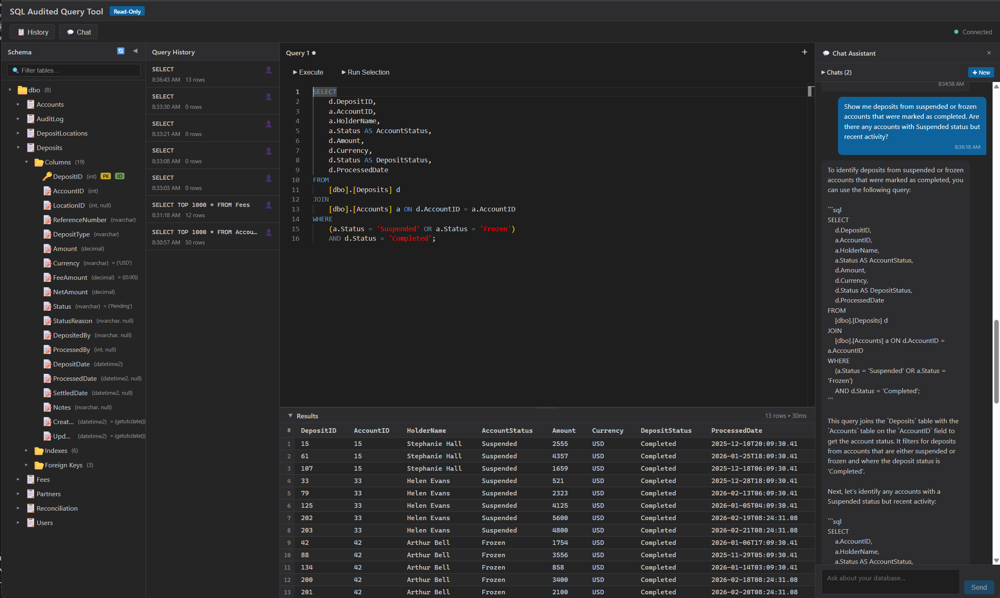

# SQL Audited Query Tool

A readonly SQL database query application designed for incident investigation, with a full GitHub issue audit trail.

## Features

- **Readonly SQL Queries** — Execute SELECT queries against SQL Server databases with enforced read-only access
- **GitHub Issue Audit Trail** — Every query execution is logged as a GitHub issue for compliance and traceability
- **Local LLM Query Assistance** — AI-powered query suggestions via a local LLM using tool calling (Ollama requests query execution from our .NET app; Data is only exposed to the local LLM running in the container host)
- **Chat Interface** — Conversational UI for building and executing queries
- **Code Context System** — LLM can analyze Entity Framework code using file reading and Roslyn-based parsing to understand entities, relationships, and mappings



## Write Script Simulator

The **Write Script Simulator** tab allows you to safely test UPDATE, INSERT, and DELETE statements without executing them. This is essential in a readonly tool — you can validate write queries, inspect execution plans, and generate deployment scripts before they run against production.

### How It Works

Write queries are **analysed but never executed**. The simulator:
- Validates SQL syntax and detects forbidden operations (DROP, TRUNCATE, ALTER, CREATE, EXEC)
- Warns about risky patterns (UPDATE/DELETE without WHERE clauses)
- Generates execution plans to estimate row impact
- Shows validation errors and warnings before the query is deployed

### Testing a Write Query

1. Open the **Write Script Simulator** tab
2. Write your UPDATE, INSERT, or DELETE statement
3. Press **Ctrl+Enter** or click **Simulate**
4. Review validation errors, warnings, and estimated affected rows
5. If valid, optionally click **Create sql-script-runner scripts** to generate versioned deployment scripts

### Configuration

Configure sql-script-runner repositories in `appsettings.json`:

```json
{
  "SqlScriptRunner": {
    "ReposBaseDirectory": "c:\\dev",
    "Repositories": {
      "payments": "payments-sql-patches",
      "tx": "transactions-sql-patches"
    }
  }
}
```

| Setting | Description |
|---------|-------------|
| `ReposBaseDirectory` | Base directory where all script repositories are cloned |
| `Repositories` | Key-value pairs mapping repository keys to folder names within the base directory |

When you generate scripts, they are created as versioned SQL files (`001_description.sql`, `002_another_change.sql`, etc.) in the target repository, ready for code review and deployment.

## Architecture

```
src/
  SqlAuditedQueryTool.Core        — Domain models, interfaces, shared types
  SqlAuditedQueryTool.Database    — SQL Server readonly connection, query execution, EF Core contexts
  SqlAuditedQueryTool.Audit       — GitHub issue audit logging
  SqlAuditedQueryTool.Llm         — Local LLM integration, tool calling handler, query generation
  SqlAuditedQueryTool.App         — Main application with chat UI

tests/
  SqlAuditedQueryTool.Core.Tests
  SqlAuditedQueryTool.Database.Tests
  SqlAuditedQueryTool.Audit.Tests
  SqlAuditedQueryTool.Llm.Tests
```

## Prerequisites

- .NET 10.0 SDK or later
- Docker Desktop with WSL2 backend
- SQL Server instance (read-only access)
- GitHub token (for audit logging)
- NVIDIA GPU (recommended for local LLM — see GPU Setup below)

## Getting Started

```bash
dotnet build
dotnet test
dotnet run --project src/SqlAuditedQueryTool.App
```

## Testing with Sample Data

The application includes a realistic cash deposit platform dataset with intentional data anomalies designed for incident investigation scenarios. These errors can be discovered by querying the database and using the chat to analyze suspicious patterns.

### Known Data Errors & Anomalies

**Partner Issues**
- **Partner PSB** (ID 4): Negative fee percentage (-0.2%) instead of positive, indicating misconfigured fee structure
- **Partner ACB** (ID 6): Status is Suspended but still has an active API key, suggesting revocation was incomplete
- **Partner SWB** (ID 8): Status is Onboarding but deposits are already flowing through accounts, violating onboarding workflow

**User & Account Issues**
- **User tmiller** (ID 8): Marked Inactive but has a login within the last 3 days, indicating orphaned/stale status
- **Account 15** (Stephanie Hall): Status is Suspended but KYC remains Verified, inconsistent compliance state
- **Account 22** (Thomas Baker): Currency is GBP but all deposits received are in USD, data integrity error
- **Account 33** (Helen Evans): Status is Suspended yet has recent Completed deposits and high balance, suggesting stale status flag
- **Accounts 38-39** (ACB): Belong to the Suspended partner but accounts remain Active
- **Account 42** (Arthur Bell): Status is Frozen with negative balance (-$1,250), indicating incomplete processing or data corruption
- **Account 47** (Irene Richardson): KYC status is RequiresUpdate but account created 300+ days ago, stale compliance flag
- **Accounts 48-50**: KYC status is Pending yet they already have completed deposits, violation of KYC-before-processing rule

**Location Issues**
- **Location 9** (Hollywood Walk ATM): Status is Maintenance but deposits continue to be processed, operational state inconsistency
- **Location 20** (Seattle Downtown Branch): MaxDepositAmount is 0.00, effectively blocking deposits

**Fee Configuration**
- **Fee 9** (Partner PSB, BulkCash): MinFee ($150) > MaxFee ($15), inverted range logic error

**Deposit Transaction Anomalies**
- **Deposits 150-153**: Structuring/smurfing pattern — 4 deposits of ~$9,500-$9,800 each from Account 25 at the same location on the same day, just under the $10,000 reporting threshold
- **Deposits 160-164**: Velocity abuse — 5 identical deposits of $4,900 from Account 30 spread across 5 different cities within the same day
- **Deposits 180-182**: Ghost deposits marked Completed but ProcessedBy is NULL, suggesting automation bypass
- **Deposit 190**: Time-travel anomaly — SettledDate (26 days ago) is BEFORE ProcessedDate (24 days ago)
- **Deposits 195-198**: Zero-fee cash deposits with $0.00 FeeAmount (should never occur per fee schedule)
- **Deposits 200-203**: Deposits processed to Frozen (Account 42) and Suspended (Account 33) accounts marked Completed
- **Deposits 210-212**: Deposits completed against the Suspended partner (ACB) and its accounts
- **Deposit 205**: Processed at Location 9 which is in Maintenance status
- **Deposits 206-207**: Possible duplicate — same account, location, amount, 3 minutes apart, same processor

### Example Investigation Questions

Ask the chat these questions to explore the sample data and test the query tool:

1. **Fraud Detection**: "Which accounts have received multiple deposits just under $10,000 in a short period? This could indicate structuring to avoid reporting requirements."

2. **Risk Analysis**: "Show me deposits from suspended or frozen accounts that were marked as completed. Are there any accounts with Suspended status but recent activity?"

3. **Partner Compliance**: "Which partners have API keys but are not in Active status? Also, what deposits have been processed against suspended partners?"

4. **Operational Issues**: "Find deposits processed at locations that are not Active, and deposits from accounts with pending or expired KYC verification."

5. **Data Integrity**: "Identify deposits where the settled date is before the processed date, or where fee amounts are zero for cash transactions. These indicate data corruption or automation failures."

6. **Complex Cross-Reference** *(great for execution plans)*: "For each partner, show me the total deposit volume and count broken down by account status and location, but only include partners where at least one of their accounts has received deposits from more than 3 different locations. Rank the partners by total volume descending."

## GPU Setup (NVIDIA + Docker + WSL2)

The local LLM (Ollama with `qwen2.5-coder:7b`) runs significantly faster with GPU acceleration. This requires NVIDIA GPU passthrough from Windows → WSL2 → Docker.

Or if using Podman, follow [this guide](https://wsl-ui.octasoft.co.uk/blog/ollama-gpu-podman-windows)

### Requirements

- NVIDIA GPU with 8GB+ VRAM (e.g., GeForce RTX 4060/4070/3060 or better)
- Latest NVIDIA Game Ready or Studio driver installed on **Windows** (not inside WSL)
- Docker Desktop with WSL2 backend enabled

### Step 1: Update WSL

The WSL kernel must support GPU paravirtualization. Run from **PowerShell (Admin)**:

```powershell
wsl --update
wsl --shutdown
```

Verify the GPU is visible inside WSL:

```bash
# In a WSL terminal (e.g., Ubuntu)
nvidia-smi
```

You should see your GPU listed. If you see "GPU access blocked by the operating system", your WSL version is too old — re-run `wsl --update`.

### Step 2: Install NVIDIA Container Toolkit (in WSL)

Open your WSL2 distro (Ubuntu) and run:

```bash
curl -fsSL https://nvidia.github.io/libnvidia-container/gpgkey \
  | sudo gpg --dearmor -o /usr/share/keyrings/nvidia-container-toolkit-keyring.gpg

curl -s -L https://nvidia.github.io/libnvidia-container/stable/deb/nvidia-container-toolkit.list \
  | sed 's#deb https://#deb [signed-by=/usr/share/keyrings/nvidia-container-toolkit-keyring.gpg] https://#g' \
  | sudo tee /etc/apt/sources.list.d/nvidia-container-toolkit.list

sudo apt-get update
sudo apt-get install -y nvidia-container-toolkit
sudo nvidia-ctk runtime configure --runtime=docker
```

### Step 3: Restart Docker Desktop

Restart Docker Desktop from the Windows system tray (right-click → Restart).

### Step 4: Verify

```bash
docker run --rm --gpus all nvidia/cuda:12.0.0-base-ubuntu22.04 nvidia-smi
```

You should see your GPU with available memory. The `qwen2.5-coder:7b` model uses ~4.5GB VRAM, fitting comfortably in an 8GB card.

### Troubleshooting

| Symptom | Fix |
|---------|-----|
| `nvidia-smi` in WSL: "GPU access blocked by the operating system" | Run `wsl --update && wsl --shutdown`, then retry |
| `nvidia-container-cli: WSL environment detected but no adapters were found` | WSL kernel too old — update WSL (see Step 1) |
| Docker `--gpus all` fails with "could not select device driver" | NVIDIA Container Toolkit not installed (see Step 2) or Docker not restarted (Step 3) |
| GPU visible but model runs on CPU | Ensure `.WithGPUSupport()` is present in `AppHost.cs` on the Ollama resource |

## GitHub Audit Trail Configuration

Every query execution is logged as a comment on a GitHub issue, creating a tamper-evident audit trail with integrity hashes. The issue number is supplied per-request from the UI. Configure the following in `appsettings.json` (or via environment variables / user secrets):

```json
{
  "GitHubAudit": {
    "RepoOwner": "your-org",
    "RepoName": "your-repo",
    "Token": "ghp_your_personal_access_token"
  }
}
```

| Setting | Description |
|---------|-------------|
| `RepoOwner` | GitHub user or organisation that owns the repository |
| `RepoName` | Repository where audit comments will be posted |
| `Token` | GitHub personal access token with `repo` scope (use `dotnet user-secrets` to avoid committing it) |

The **Issue Number** is supplied per-request from the UI (not in config). If no issue number is provided, the audit entry is logged locally only.

If any of the above config values are missing, the application still works — audit entries are logged locally via `ILogger` but not posted to GitHub.

## Azure DevOps Audit Trail Configuration

Audit entries can also be posted as comments on an Azure DevOps work item. Like GitHub, the work item ID is supplied per-request from the UI. Configure the following in `appsettings.json`:

```json
{
  "AzDoAudit": {
    "Organisation": "your-org",
    "Project": "your-project",
    "Token": "your-personal-access-token"
  }
}
```

| Setting | Description |
|---------|-------------|
| `Organisation` | Azure DevOps organisation name |
| `Project` | Azure DevOps project name |
| `Token` | Personal access token with work item read/write scope |

The **Work Item ID** is supplied per-request from the UI. If no work item ID is provided, the AzDO audit step is skipped. Both GitHub and AzDO audit trails can be active simultaneously — each request can target one, both, or neither.

## Security

- All database connections are **read-only** — no INSERT, UPDATE, DELETE, or DDL operations permitted
- The local LLM never receives actual database data — only schema metadata for query generation
- All query executions are audited to GitHub issues with full context

## Code Context System

The LLM can analyze Entity Framework code to understand database structure and generate better queries.

### Capabilities
- **Discover entities**: Find all DbContext classes and their entity types
- **Analyze properties**: Extract property types, data annotations, keys, and nullability
- **Understand relationships**: Identify navigation properties and foreign keys
- **Search code**: Find patterns using regex search
- **Read files**: Access specific code files

### Configuration
Add to `appsettings.json`:
```json
{
  "CodeContext": {
    "DefaultRepositoryPath": "C:\\MyProject\\src",  // Optional: default code path
    "AllowedDirectories": ["C:\\MyProject"],         // Whitelist for security
    "MaxFileSizeBytes": 1048576                     // 1MB max per file
  }
}
```

### Usage
The system provides 7 AI tools the LLM can invoke:
- `ReadFile(path)` - Read a specific file
- `ListFiles(directory, pattern)` - List files (e.g., "*DbContext.cs")
- `SearchCode(pattern, directory)` - Regex search across files
- `AnalyzeEntityFrameworkContext(directory)` - Deep Roslyn analysis of EF entities
- `AddContextDirectory(directory)` - Add directory to allowed list (session-scoped)
- `RemoveContextDirectory(directory)` - Remove directory from session list
- `ListContextDirectories()` - View all allowed directories (config + session)

**Dynamic Directory Access:**

You can add directories on-the-fly during a chat session without restarting the app:

```
User: "Can you analyze the code in D:/git/my-new-project?"
LLM: [calls AddContextDirectory] "Added directory. Analyzing..."
```

Session-added directories are temporary and reset on app restart. For permanent access, add them to `appsettings.json`.

**Example LLM conversation:**
```
User: "What entities are in my codebase?"
LLM: [calls AnalyzeEntityFrameworkContext] "Found 3 entities: User, Order, Product..."

User: "What properties does User have?"
LLM: "User has: Id (int, PK), Name (string, Required, Max 100), Email (string, nullable)..."

User: "Add D:/git/admin-portal to the context"
LLM: [calls AddContextDirectory] "Directory added. You can now query code from admin-portal."
```

**Tests:** See `tests/SqlAuditedQueryTool.Llm.Tests/Services/CodeContextAssistantTests.cs`

## Sample Investigation Questions

The LLM's strength lies in combining code understanding with database queries. Ask the chat these questions to see how it analyzes business logic and investigates data anomalies in the sample dataset:

### 1. **Code-First Risk Pattern Detection**

> "Are there any deposits that would be flagged as structuring risks by the business rules?"

The LLM reads the Deposit entity to understand the data structure (Amount, Status, ProcessedDate fields), then searches for the characteristic pattern: multiple deposits just under reporting thresholds ($9,000–$9,999) from the same account within a short timeframe. It executes a query to find accounts matching this behavior and reveals the suspicious pattern to you.

### 2. **Business Logic Deep Dive**

> "What conditions would cause an account to fail compliance checks?"

The LLM analyzes the Account and KYC entities to understand the compliance rules encoded in the schema (KYCStatus states like "Pending", "RequiresUpdate", "Verified"). It then queries for accounts violating these rules—such as accounts with "Pending" KYC status that already have completed deposits, or accounts marked "Suspended" with recent transaction activity—exposing inconsistencies in the system.

### 3. **Fee Configuration Anomalies**

> "Which partners have misconfigured fee schedules, and which deposits would be affected?"

The LLM reads the Fee and Partner entities to understand fee validation rules (MinFee should be less than MaxFee, FeePercentage should be positive). It searches the database for partners with inverted ranges (MinFee > MaxFee) or negative fee percentages, then identifies all deposits processed under those misconfigured fee schedules.

### 4. **Cross-Entity Consistency Checks**

> "Show me deposits processed at locations or from partners that shouldn't be accepting deposits."

The LLM examines the Deposit, DepositLocation, and Partner entities to understand valid processing states. It then queries for deposits at Locations in "Maintenance" status, or deposits from accounts belonging to "Suspended" or "Onboarding" partners, revealing operational state mismatches that bypass business controls.
